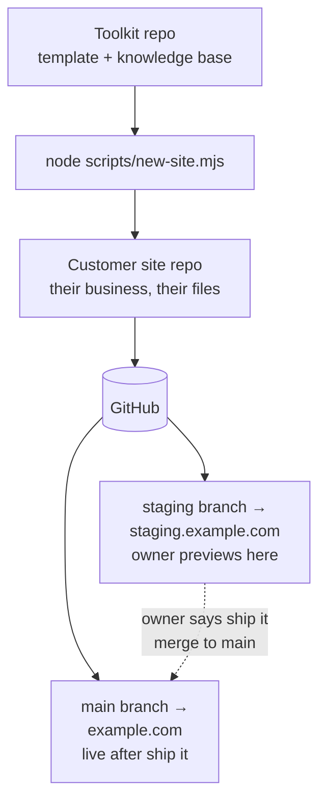

# Main Street (working name)

**A professional website for your small business for about $12 a year.** No page builder. No monthly fees. No developer on retainer. You update it by talking: tell your AI assistant what you want in plain English, look at the preview on your phone, and say "ship it."

**Watch how it works** (36 seconds, no sound needed):

https://github.com/user-attachments/assets/752e5e89-482f-40f9-b1c0-d4fab41c60b9

**Watch the full build** (70 seconds, no sound needed): one barbershop, idea to live site.

https://github.com/user-attachments/assets/a0c8180d-cec6-4d3b-bd72-366a873c2776

(The second video shows the one-time setup, terminal and all. Day to day looks like the first video: one message, one preview link, "ship it.")

## Is this for you?

- You own a small business and want a website that looks professional.
- You don't want to learn a page builder or pay a monthly fee.
- You're comfortable chatting with an AI assistant (or you know someone who is).

If that's you, keep reading. You need about an afternoon and a domain name (about $12 a year). That's the whole budget.

## How it works (the 30-second version)

1. **You say what you want**, in plain words: "Change our Saturday hours to 9 to 2." You say it to the AI chat you already pay for. No API keys, no usage billing.
2. **You get a preview link.** Open it on your phone. It looks exactly like your site with the change applied.
3. **You say "ship it."** Your live site updates in about a minute.

That's the whole system. The preview step is what keeps your live site safe: nothing goes public until you've seen it and approved it. Made a mistake? One click rolls it back (your AI can show you where).

## What it costs, honestly

About $12 a year for the domain name. Everything else runs on free tiers, plus the AI chat subscription you probably already pay for (no API usage charges, ever). The full breakdown, including free-tier limits and what could optionally cost money: [docs/the-12-dollar-stack.md](docs/the-12-dollar-stack.md).

## You don't need to be technical (after one afternoon)

- **Day to day: no code, no terminal, no jargon.** You talk to the AI assistant you already pay for. It handles the technical parts; you make the decisions.
- **The one-time setup takes an afternoon** (or hand it to someone technical): getting the site online. Your AI talks you through it, and it never needs API keys: [setup guide](template/docs/setup-guide.md), [connect your AI](template/docs/connect-your-ai.md).
- The one thing worth knowing: your secret keys (for the contact form) live in the Cloudflare dashboard, never in your website files. Your AI walks you through it: [template/docs/api-keys.md](template/docs/api-keys.md).

See what a finished site looks like, what the setup really involves (real commands, real output), and how easy everyday updates are: [template/docs/examples.md](template/docs/examples.md).

---

## Setting up a site (for the person doing the technical setup)

> Everything below is for whoever sets sites up: an agency, a freelancer, or the tech-savvy friend. Business owners can stop here; your site's own README (inside your site's repo) is written for you.
>
> **Setting up your own business's site, not someone else's?** You don't need the toolkit workflow below. Grab the `template/` folder and follow [the setup guide](template/docs/setup-guide.md) inside it; that folder is your entire site.

Two repositories, two audiences:

- **This repo (the toolkit)**: the generator. The pristine site template, the scaffolder, the AI knowledge base (rules, features, presets), and the guides.
- **Each customer site repo**: a scaffolded copy of `template/`, owned by the business. This is where the owner lives with their AI assistant. They never need to see this toolkit.



### Scaffold a new site

```bash
node scripts/new-site.mjs ../acme-plumbing
cd ../acme-plumbing
npm install
npm run setup
```

`new-site.mjs` copies `template/` into the target folder, names the package after the directory, verifies the copy, and initializes git. It refuses to overwrite a non-empty directory without `--force`, refuses to build inside the toolkit folder (your site lives **next to** the toolkit as `../acme-plumbing`, so it can become its own GitHub repo), and it never touches the network.

Then follow the customer-facing guides inside the new site: `docs/setup-guide.md` (GitHub → Cloudflare Pages → domain), `docs/api-keys.md` (contact form email + visitor stats).

> **Heads-up from real experience:** when you connect the repo in Cloudflare Pages, the Cloudflare Pages GitHub App may only have access to some of your repos, and the repo picker will say "No repositories matching." Fix: on GitHub, go to Settings → Applications → Cloudflare Pages → Configure, and grant it access to the new repo (or all repositories). Then the repo appears in the picker.

### The model every site follows

- **`staging` branch → staging site.** Every change lands here first. The owner opens one stable URL on their phone and looks at it.
- **Owner says "ship it" → merge `staging` into `main` → production.** `main` deploys to the live domain automatically.
- **Deploys only from git.** No manual deploys, ever. They bypass the record and the next push silently reverts them.
- **Missing key? The feature degrades, the page never breaks.** API keys live in Cloudflare (Pages → Settings → Environment variables), never in a repo.

### What's in this repo

```
template/            The pristine generated site. Scaffold it, don't edit it in place.
  index.html         Homepage (neutral placeholder copy; the wizard + AI fill it in)
  site.config.json   Business facts + feature flags (neutral defaults, schema-validated)
  scripts/           setup wizard, presets, post-deploy audit, image optimizer
  rules/             Focused instruction files the AI loads on demand (see CLAUDE.md)
  features/          One doc per toggleable feature
  presets/           Business-type bundles (bakery, restaurant, home-services, ...)
  docs/              Owner-facing guides: setup, API keys, examples, quickstart, FAQ
  functions/         Cloudflare Pages Functions (contact form, staging noindex)
scripts/
  new-site.mjs       The scaffolder: template/ → new customer repo
  make-journey-video.py  Regenerates the 36-second walkthrough video (PIL + ffmpeg)
  make-end-to-end-video.py  Regenerates the 70-second idea-to-live-site video (PIL + ffmpeg)
docs/
  the-12-dollar-stack.md   The honest bill: what's free, what the domain costs
  domains-and-dns.md       DNS on Cloudflare, staging subdomains
  for-agencies.md          The per-client playbook
  pressure-test.md         The adversarial review (see below)
```

The knowledge base (`rules/`, `features/`, `presets/`) lives **only** in `template/`: every customer site carries its own copy, so each site is self-sufficient and its AI never needs this toolkit.

### Improving the template

1. Make the change in `template/` here.
2. Validate it: scaffold a throwaway site with `new-site.mjs`, run `npm install`, `npm run setup`, `npm run build`, and the audit.
3. Commit here. Existing customer sites pick up template improvements through their AI assistant (or a manual copy). There is deliberately no auto-update: the owner's live site never changes without them saying so.

### Pressure test

[docs/pressure-test.md](docs/pressure-test.md) is the adversarial review: zero-skill walkthrough findings, hostile-input tests, broken-state recovery, the top-5 ways an owner gets stuck, cost honesty, the abandoned-for-a-year test, and a security once-over, with what was fixed and what wasn't.
