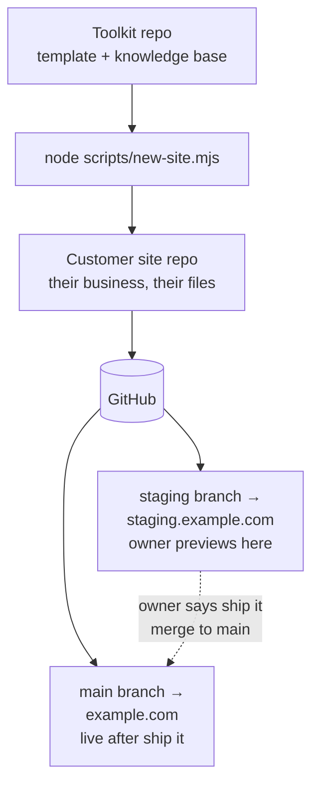

# Main Street (working name)

**The $12/year website stack.** A toolkit for giving small businesses a fast, professional website they can update themselves with AI, for the price of a domain name.

Two repositories, two audiences:

- **This repo (the toolkit)**: the generator. The pristine site template, the scaffolder, the AI knowledge base (rules, features, presets), and the guides. For the person setting sites up (an agency, a freelancer, a tech-savvy friend).
- **Each customer site repo**: a scaffolded copy of `template/`, owned by the business: this is where the owner lives with their AI assistant. They never see this toolkit.



## Scaffold a new site

```bash
node scripts/new-site.mjs ../acme-plumbing
cd ../acme-plumbing
npm install
npm run setup
```

`new-site.mjs` copies `template/` into the target folder, names the package after the directory, verifies the copy, and initializes git. It refuses to overwrite a non-empty directory without `--force`, and it never touches the network.

Then follow the customer-facing guides inside the new site: `docs/setup-guide.md` (GitHub → Cloudflare Pages → domain), `docs/api-keys.md` (contact form email + visitor stats).

## The model every site follows

- **`staging` branch → staging site.** Every change lands here first. The owner opens one stable URL on their phone and looks at it.
- **Owner says "ship it" → merge `staging` into `main` → production.** `main` deploys to the live domain automatically.
- **Deploys only from git.** No manual deploys, ever. They bypass the record and the next push silently reverts them.
- **Missing key? The feature degrades, the page never breaks.** API keys live in Cloudflare (Pages → Settings → Environment variables), never in a repo.

## What's in this repo

```
template/            The pristine generated site. Scaffold it, don't edit it in place.
  index.html         Homepage (neutral placeholder copy; the wizard + AI fill it in)
  site.config.json   Business facts + feature flags (neutral defaults, schema-validated)
  scripts/           setup wizard, presets, post-deploy audit, image optimizer
  rules/             Focused instruction files the AI loads on demand (see CLAUDE.md)
  features/          One doc per toggleable feature
  presets/           Business-type bundles (bakery, restaurant, home-services, ...)
  docs/              Owner-facing guides: setup, API keys, examples, quickstart, FAQ
  functions/         Cloudflare Pages Functions (contact form, staging noindex)
scripts/
  new-site.mjs       The scaffolder: template/ → new customer repo
docs/
  the-12-dollar-stack.md   The honest bill: what's free, what the domain costs
  domains-and-dns.md       DNS on Cloudflare, staging subdomains
  for-agencies.md          The per-client playbook
```

The knowledge base (`rules/`, `features/`, `presets/`) lives **only** in `template/`: every customer site carries its own copy, so each site is self-sufficient and its AI never needs this toolkit.

## Improving the template

1. Make the change in `template/` here.
2. Validate it: scaffold a throwaway site with `new-site.mjs`, run `npm install`, `npm run setup`, `npm run build`, and the audit.
3. Commit here. Existing customer sites pick up template improvements through their AI assistant (or a manual copy). There is deliberately no auto-update: the owner's live site never changes without them saying so.

## Cost honesty

~$12/year per site: the domain name. Everything else is free-tier. The full breakdown, including free-tier limits and what could optionally cost money: [docs/the-12-dollar-stack.md](docs/the-12-dollar-stack.md).

## Pressure test

[docs/pressure-test.md](docs/pressure-test.md) is the adversarial review: zero-skill walkthrough findings, hostile-input tests, broken-state recovery, the top-5 ways an owner gets stuck, cost honesty, the abandoned-for-a-year test, and a security once-over, with what was fixed and what wasn't.
