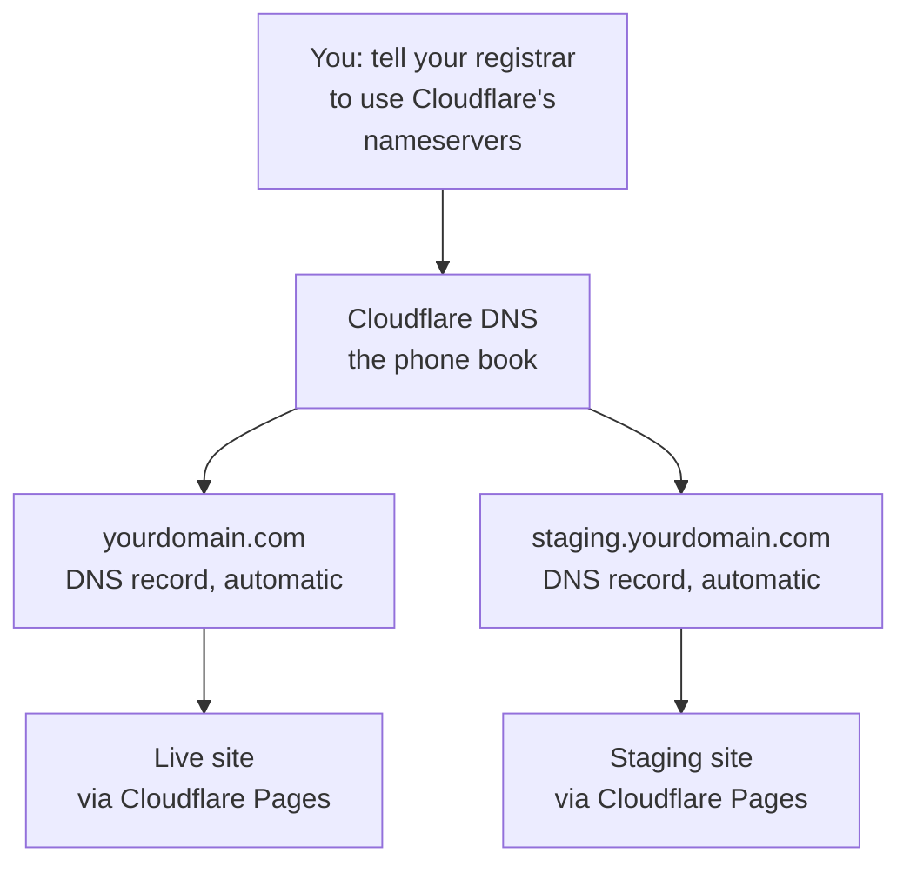

# Domains and DNS: why Cloudflare should hold your DNS

Your domain needs two jobs done: **hosting the site** (Cloudflare Pages) and **DNS** (the phone book that turns `yourdomain.com` into an address). When Cloudflare does both, the good stuff happens automatically:

- Your staging site gets a clean address: `staging.yourdomain.com` instead of `staging.random-words.pages.dev`.
- Cloudflare creates the DNS records for both your live site and staging when you attach the domains. No records to type by hand.
- SSL certificates are automatic on every hostname.

None of this is required. The site works fine on `*.pages.dev` addresses with DNS anywhere, but this is the recommended setup, and the setup guide assumes it.

## The one move: point your nameservers at Cloudflare

"Moving DNS to Cloudflare" means one change: tell your domain registrar to use Cloudflare's nameservers instead of theirs. Cloudflare is still not your registrar unless you transfer the domain (optional, see below); you're just renting their phone book.

**If you bought the domain from Cloudflare Registrar:** you're done. DNS is already here. Skip to the setup guide.

**If your domain is at GoDaddy, Namecheap, Google Domains, etc.:**

1. In Cloudflare: **Add domain** (free plan is fine), enter your domain, continue.
2. Cloudflare shows you two nameservers, like `ara.ns.cloudflare.com` and `bob.ns.cloudflare.com`.
3. **Before you change anything**, read the email warning below.
4. At your registrar, find the nameserver settings for the domain and replace them with Cloudflare's two. (Registrars bury this under "DNS", "Nameservers", or "Domain settings". Your AI assistant can walk you through your specific registrar.)
5. Back in Cloudflare, click **Check nameservers**. Status flips to **Active** once the change propagates (usually minutes, sometimes a few hours). Don't keep changing things while you wait.

## ⚠️ The email warning (read before switching nameservers)

When you change nameservers, **every DNS record moves to Cloudflare's blank copy** of your zone. Cloudflare scans and imports common records automatically, but verify these yourself or email breaks:

- **MX records**: where incoming email goes (Google Workspace, Microsoft 365, etc.). If mail suddenly stops after the switch, this is why.
- **SPF / DKIM / DMARC** (TXT records): prove your email is legitimate. Needed for the contact form's sending address too.
- Anything unusual: subdomains pointing at other services, verification records.

The fix is simple: in your registrar's DNS panel, screenshot or copy every record *before* the switch, then check they all exist in Cloudflare (**DNS** → **Records**) after. Your AI assistant can compare the two lists with you. If something's missing, add it by hand. It takes a minute.

If you use Cloudflare Email Routing (recommended in the setup guide), Cloudflare adds the MX records for you during its own setup flow.

## Optional: transfer the domain to Cloudflare Registrar

Not required. Transferring moves billing to Cloudflare (wholesale pricing, no markup, often cheaper renewals than GoDaddy/Namecheap) and puts everything in one dashboard. Downsides: some TLDs aren't supported, and there's a 60-day lock after registration/transfer. Do it later if you want; it changes nothing about the site.

## What the setup guide does with your DNS

Once your domain is **Active** on Cloudflare:

1. Attaching `yourdomain.com` to the Pages project auto-creates its DNS record (proxied, orange cloud) and provisions SSL.
2. Attaching `staging.yourdomain.com` creates its DNS record the same way. Then you retarget that record's CNAME from `<project>.pages.dev` to `staging.<project>.pages.dev` so it serves the `staging` branch (full steps in the setup guide's Step 6).

The one rule: **leave those records proxied** (orange cloud on). If a record gets set to "DNS only" (gray cloud), the staging address can silently start serving the *live* site instead of staging. If staging ever shows the wrong content, check the cloud color first.
