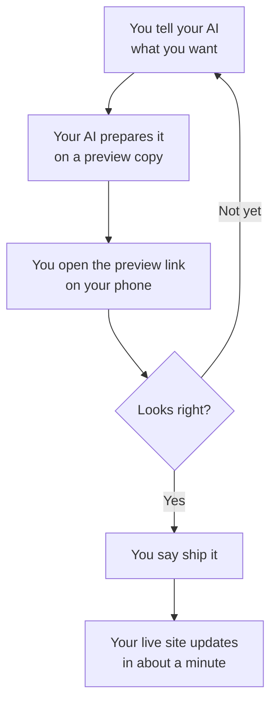
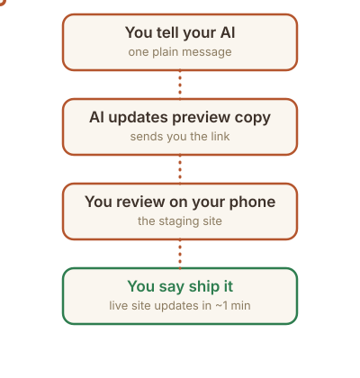

# Your business website

This is **your website**: the files, the words, the photos. It costs about $12 a year (just the domain name) and you update it by *talking*: you tell your AI assistant what you want in plain English, it makes the change, you look at a preview on your phone, and you say "ship it."

No page builders. No monthly fees. No developer on retainer. And you can never break it beyond repair (see "Made a mistake?" below).

## How updates work: the golden loop

You never edit the live site directly. Every change follows the same loop:

That's the whole system. One loop, every time, no exceptions. It’s what keeps the live site safe while you experiment freely.

**Watch the whole journey** (36 seconds, no sound needed):

https://github.com/user-attachments/assets/752e5e89-482f-40f9-b1c0-d4fab41c60b9

(That's the everyday experience: one message, one preview link, "ship it." The one-time setup is a separate afternoon: [docs/setup-guide.md](docs/setup-guide.md).)

**What to say to your AI** (copy-paste any of these):

- "Change our Saturday hours to 9am to 2pm."
- "Add a banner: we're closed Thanksgiving week."
- "Add drain cleaning for $129 to the price list."
- "Replace the homepage photo with the one I just attached."

More examples, including before-and-after walkthroughs: [docs/examples.md](docs/examples.md).

You can also send a voice note instead of typing. Your AI will say back what it heard in one sentence and take it from there.

## Your first week

Do these in order. Each one is small; together they take an afternoon.

- [ ] **Connect your AI.** [docs/connect-your-ai.md](docs/connect-your-ai.md) hooks up the chat subscription you already pay for. No API keys, ever. Do this first; everything below assumes it's done.
- [ ] **See your site.** Your AI (or whoever set this up for you) will give you two links: the **live site** and the **preview site**. Open both on your phone and save them.
- [ ] **Gather your stuff.** [docs/gather-your-stuff.md](docs/gather-your-stuff.md) is the weekend homework: your photos, your story, your prices. They go in the shoebox (`content/brand/`), and your AI builds the site from them. Or skip the files and ask your AI to interview you in chat.
- [ ] **Read the examples.** [docs/examples.md](docs/examples.md) shows five everyday updates: holiday hours, a new service, an announcement banner, a new photo, a new page, each as one message you'd send your AI. This is the "see, it's actually easy" proof.
- [ ] **Try one tiny change.** Pick something harmless, like the announcement banner: "Add a banner: welcome to our new website!" Watch it appear on the preview site, then say "ship it."
- [ ] **Set up your keys.** [docs/api-keys.md](docs/api-keys.md) walks you (and your AI) through the two free keys: one so the contact form emails you, one for visitor stats. Skip them and the site still works. It just does a little less.
- [ ] **Learn the undo.** Read "Made a mistake?" below. It takes 30 seconds and you'll feel much braver afterwards.
- [ ] **Know the no-install update path.** [docs/editing-in-browser.md](docs/editing-in-browser.md): fix a typo straight on GitHub.com. No AI, no terminal, no setup.
- [ ] **Need a logo, a video, or online selling?** [docs/connectors.md](docs/connectors.md) shows how your AI can borrow other apps (Canva, Higgsfield, Shopify), with copy-paste requests.

Then, when you're ready: [docs/setup-guide.md](docs/setup-guide.md) (your own domain name), [docs/owner-quickstart.md](docs/owner-quickstart.md) (getting good at directing your AI), [docs/faq.md](docs/faq.md).

## Every month: the checkup

Websites go stale when nobody looks at them. Once a month, say **"run the monthly checkup"** to your AI. It reviews the whole site for stale hours, old photos, leftover placeholder text, and broken links, then proposes fixes in plain English. You approve each one; nothing changes without your yes. This is how the site stays fresh without you having to remember.

## Made a mistake? Undo in one click

Every version of your site is saved. If anything ever looks wrong, the fastest fix is to tell your AI **"undo that"**: it puts the previous version on your preview site, you check it, and you say "ship it." Or do it yourself, any time:

1. Open the **Cloudflare dashboard** → **Workers & Pages** → your site.
2. Click **Deployments**.
3. Find the version from before the mistake and click **Rollback**.

That's it: the live site goes back to exactly how it was. Nothing is ever lost, and you don't need anyone's help to do it.

## The one rule: secrets

Your site uses a couple of secret keys (for the contact form email and visitor stats). They live in **Cloudflare's dashboard** (Pages → Settings → Environment variables) and **nowhere else**:

- Never paste a key into these website files.
- Never paste a key into a chat message or email.
- If a key ever leaks, delete it where you got it and make a new one. Two minutes, problem solved.

Full guide: [docs/api-keys.md](docs/api-keys.md).

## What's in this folder (the 30-second tour)

- `index.html`: your homepage. The words live here.
- `site.config.json`: your business facts: name, hours, address, phone, and which features are on. The setup wizard (`npm run setup`) edits this for you.
- `public/images/`: your photos.
- `docs/`: plain-English guides, including the [setup guide](docs/setup-guide.md) and [API keys](docs/api-keys.md).
- Everything else is machinery your AI handles. You don't need to open it.

## For the technically curious

The site is a static build (Vite, plain HTML/CSS, no framework) deployed on Cloudflare Pages. `main` = live site, `staging` = preview site. The contact form runs on a Pages Function with graceful degradation. `CLAUDE.md` + `rules/` are the operating manual your AI follows. None of this is required reading. It's here so your AI (or a future developer) has the full picture.
