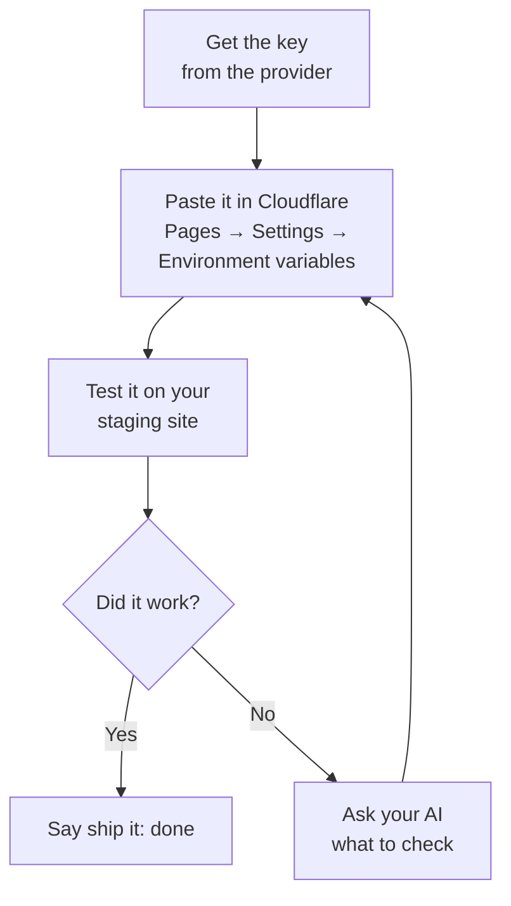
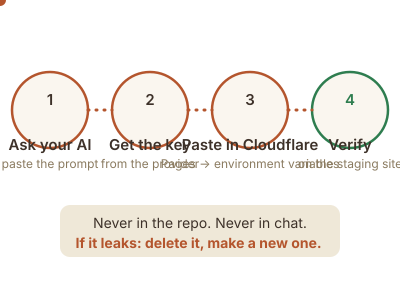

# API keys, in plain English

Your site needs up to **two keys** to unlock everything. Both are free. Without them, nothing breaks. The site just does a little less (this page tells you exactly what).

**Do this with your AI.** You don't have to read this whole page and click around alone. Copy one of the prompts at the bottom into whatever chat AI you use (muse.ai, claude.ai, chatgpt.com, any of them), and it will walk you through each screen, click by click. That's what it's for.

## The one rule about keys

A key is like a house key: whoever has it can act as you. So:

- Keys go in **Cloudflare's dashboard only** (the exact spot is below). Never in your website's files, never in a chat message, never in email.
- If a key ever leaks (pasted somewhere public, emailed to the wrong person), don't panic: go back to the provider, delete it, and make a new one. Two minutes, problem solved.





## Key 1: Resend, which delivers your contact form messages

**What it does:** when a visitor submits your contact form, this key lets your site hand the message to Resend, which emails it to you.
**Why you want it:** without it, visitors see your email address and have to write to you themselves. With it, the form just works.

**Get it (about 5 minutes):**
1. Go to **resend.com** and click **Sign up**. Use your business email.
2. Once you're in, look in the left sidebar for **API Keys** and click it.
3. Click **Create API Key**. Give it a name like `website-contact-form`. For permission, choose **Sending access**.
4. Click **Create**. Resend shows you the key **once**. It starts with `re_`. Copy it somewhere safe for the next two minutes (a notes app is fine; you'll paste it into Cloudflare right away, then you can forget it).

**Where to paste it:**
1. Open the **Cloudflare dashboard** → **Workers & Pages** → click your site's project.
2. Go to **Settings** → **Environment variables**.
3. Under **Production**, click **Add variable**:
   - Name: `RESEND_API_KEY`, value: paste the key.
   - Name: `CONTACT_TO_EMAIL`, value: the email address where you want form messages delivered (usually your business email).
4. (Optional) Under **Preview**, add the same two variables if you want the contact form to work on your staging site too.
5. Click **Save**. Then make the change take effect with a redeploy: go to **Deployments**, click **⋯** on the latest deployment, and choose **Retry deployment** (or push any small change). The form starts working after the rebuild (about a minute).

**One more thing: sending from your own domain (optional but recommended)**
Right now Resend sends from a generic address. To send from `noreply@yourdomain.com` (looks more professional, lands in inboxes better):
1. In Resend's sidebar, click **Domains** → **Add Domain** → type your domain.
2. Resend shows you 3 DNS records to add. Your AI can walk you through adding them in Cloudflare's DNS. It takes a few minutes, then Resend verifies automatically.

**How to verify it worked:** open your **staging** site, fill in the contact form, hit send. The message should arrive at your CONTACT_TO_EMAIL inbox within a minute. If it doesn't, ask your AI: the usual culprit is a typo pasted into the key.

**If you skip it:** the contact form area shows your email address and phone number instead. Visitors can still reach you; the page never looks broken.

## Key 2: Cloudflare Web Analytics (visitor stats)

**What it does:** counts how many people visit your site and which pages they read. No cookies, no creepy tracking.
**Why you want it:** to answer "is my website actually being visited?" without guessing.

**Get it (about 3 minutes):**
1. In the **Cloudflare dashboard**, look in the left sidebar for **Web Analytics** and click it.
2. Click **Add a site**, type your domain (e.g. `acmeplumbing.com`), and confirm.
3. Cloudflare shows you a small snippet of code (if it asks how to install, choose the **JS snippet** option). Inside the snippet you'll see `"token": "..."`. That quoted value is your token. Copy just the token (the part inside the quotes, about 32 characters).

**Where to paste it:**
1. Open the **Cloudflare dashboard** → **Workers & Pages** → click your site's project.
2. Go to **Settings** → **Environment variables**.
3. Under **Production**, click **Add variable**: name `CF_ANALYTICS_TOKEN`, value: paste the token.
4. Click **Save** and redeploy (or push any change). The token is read at build time. It takes effect on the next build, and it never appears in your website's files.

**How to verify it worked:** visit your live site yourself, then check Cloudflare → Web Analytics → your site. Your visit should show up within a few minutes.

**If you skip it:** nothing changes on the site at all. You just won't have visitor numbers.

## Companion settings (not keys, but set them in the same place)

These live alongside the keys in Cloudflare → Pages → Settings → Environment variables:

| Setting | What it does | Required? |
|---|---|---|
| `CONTACT_TO_EMAIL` | Where contact form messages are delivered | Yes, if you set up Resend |
| `FROM_EMAIL` | The "from" address on those emails | No, defaults to `noreply@<your-domain>` |
| `RESEND_API_KEY` | The Resend key from above | Yes, for the form to send email |

## Testing on your own computer (optional)

If you (or your AI) ever run the site locally with `npm run dev` and want the contact form to actually send, create a file called `.dev.vars` in your site's folder with one line:

```
RESEND_API_KEY=re_your_key_here
```

That file is private to your computer. It's on the never-commit list, so it can't end up on GitHub by accident. The setup wizard (`npm run setup`) can create it for you if you paste the key when asked.

## Copy-paste prompts for your AI

Paste any of these into your chat AI and it will guide you through the screens:

```
Walk me through creating a Resend API key for my website's contact form.
I'm not technical: tell me exactly what to click.
```

```
Help me add my Resend API key to Cloudflare Pages environment variables.
Tell me exactly where to click, and remind me what NOT to do with the key.
```

```
I want visitor stats on my site. Walk me through setting up Cloudflare
Web Analytics and show me where the token goes in Cloudflare (never in
my site's files).
```

## If something goes wrong

- **"Invalid API key"**: you probably copied it with a missing character. Delete the variable in Cloudflare, create a fresh key in Resend, and paste again carefully.
- **Form sends but no email arrives**: check CONTACT_TO_EMAIL for a typo, and check your spam folder.
- **Analytics shows nothing**: the `CF_ANALYTICS_TOKEN` in Cloudflare's environment variables must be the exact token from Web Analytics (the 32-character value inside `"token": "..."` in the snippet, not the whole snippet). And the site must be rebuilt *after* you added it: Deployments → ⋯ → Retry deployment. Stats only count visits to the live site, and only after the change is shipped there.

Still stuck? Paste the error message into your AI and say which step you were on. That's a 5-minute fix, not a disaster.
