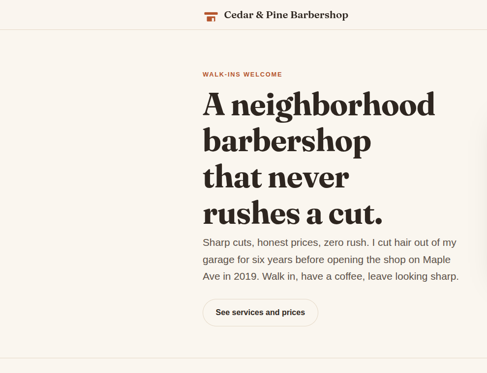
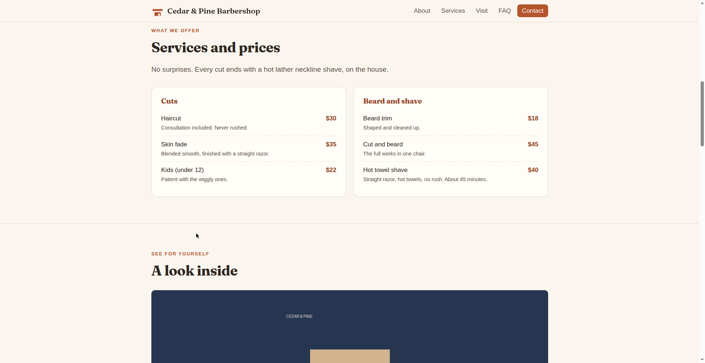
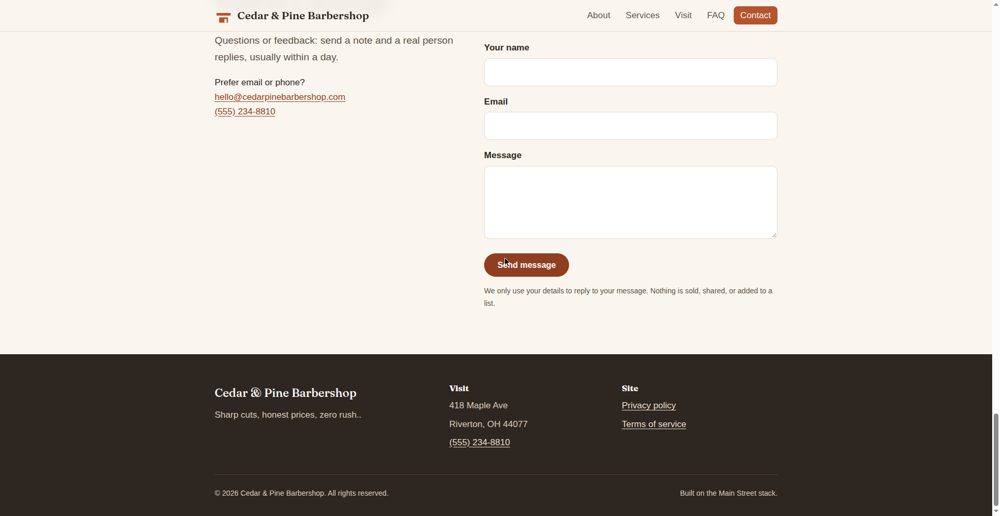

# Updates are easy: a day in the life

Meet **Acme Plumbing**, a fictional plumbing business. Below are five completely ordinary updates, written exactly as they'd happen. In every case the owner types **one message** into their chat AI, glances at their phone, and says two words: **"ship it."**

---

## What a finished site looks like

This is Cedar and Pine Barbershop, the fictional demo site Main Street was built and tested with. Real screenshots of the live site, not mockups.


*The homepage: the owner's own words, one clear button. Every site starts from the same template and ends up sounding like its business.*


*The price list. The owner updates it by sending one message, like example 2 below.*


*The contact section and footer. The email service isn't connected on this demo, so visitors see the email address instead of a form. Nothing breaks; the page just degrades gracefully.*

## What setup actually looks like

The one-time setup is a short command sequence run by the helper (or the owner's AI). Below is the real output from a real run, for a fictional bakery. Paths are from the computer where it was recorded; yours will show your own folders.

**1. Create the site folder.**

```
$ node scripts/new-site.mjs ../birch-bakehouse

Done! Your new site is ready at /tmp/birch-bakehouse
  88 files copied and verified.
  Git repository initialized with everything staged.

  One-time git setup (so you can save versions of your site):
    git config user.name "Your Name"
    git config user.email "you@example.com"
  Then: git commit -m "First version of my site"

Next steps (each takes a few minutes):
  1. cd ../birch-bakehouse
  2. npm install        (downloads the build tools, one time only)
  3. npm run setup      (the friendly wizard: your business details)
  4. npm run dev        (see your site at http://localhost:5173)
```

**2. Install the build tools (one time) and answer the wizard.**

```
$ npm install
added 15 packages in 11s

$ npm run setup

Welcome to Main Street! Let us set up your website.
Press Enter to accept the answer in [brackets].

Step 1 of 3: your business
  Business name [Your Business Name]: Birch Bakehouse
  Tagline (one short sentence) [What you do, in one short sentence]: Fresh bread every morning
  Phone number [(555) 000-0000]: (555) 234-5678
  Contact email [hello@example.com]: hello@birchbakehouse.com
  Year founded (optional, Enter to skip): 2019

Step 2 of 3: your address and domain
  Street address [123 Main Street]: 14 Maple Ave
  City [Your City]: Riverton
  State (2 letters) [ST]: NJ
  ZIP code [00000]: 08077
  Domain name [example.com]:
  (Keeping the placeholder example.com, your AI will help you get a real domain later.)

Step 3 of 3: pick a starting preset (turns the right features on for your kind of business)
  1. bakery: bakeries, cafes, food shops (menu, photo gallery, reviews)
  2. restaurant: restaurants, bars (menu, gallery, questions)
  3. home-services: plumbers, electricians, landscapers (quote form, reviews, questions)
  4. retail: flower shops, boutiques, gift shops (photo gallery, reviews, contact form)
  5. salon-wellness: salons, spas, barbers (gallery, booking, prices)
  6. professional: offices, consultants, agencies (reviews, questions, contact form)
  7. Skip (keep current features)
  Choice [7]: 1
Preset "bakery" applied (1 feature flag changed).

Done! site.config.json is updated.
The page copy is neutral placeholder text.
Ask your AI assistant: "rewrite the homepage copy for my business, keeping the layout."
```

**3. Build the site.**

```
$ npm run build

vite v5.4.21 building for production...
transforming...
✓ 7 modules transformed.
rendering chunks...
computing gzip size...
dist/404.html                      1.47 kB │ gzip: 0.71 kB
dist/terms-of-service/index.html   2.66 kB │ gzip: 1.22 kB
dist/privacy-policy/index.html     2.79 kB │ gzip: 1.26 kB
dist/index.html                   13.74 kB │ gzip: 3.72 kB
dist/assets/styles-C3pyQLMa.css    8.10 kB │ gzip: 2.43 kB
dist/assets/main-BaC7Ft1i.js       2.00 kB │ gzip: 1.01 kB
✓ built in 210ms
```

**4. Audit it.** This is the real check, run here against the live demo barbershop:

```
$ npm run audit https://main-street-dogfood-barbershop.pages.dev

  PASS  homepage returns 200
  PASS  /privacy-policy/ returns 200
  PASS  /terms-of-service/ returns 200
  PASS  missing page returns 404
  PASS  http redirects to https
  PASS  staging sends X-Robots-Tag noindex
  PASS  homepage has JSON-LD structured data
  PASS  homepage has og:title

8/8 checks passed.
```

That's the technical afternoon, on paper. The rest is GitHub, Cloudflare, and the domain, which [the setup guide](setup-guide.md) walks through click by click.

---

## 60-second updates: cheat sheet

Copy any of these into your chat AI as-is (swap in your own details):

```
Change my Saturday hours to 9am to 2pm.
```

```
Add drain cleaning for $129 to my services list.
```

```
Put up a banner: Now booking spring cleanups, call for a free estimate.
```

```
Swap the homepage photo for the one I'm attaching. Put it first.
```

```
Add a Reviews page with the three testimonials I pasted below.
```

That's the whole skill. Everything below is just those one-liners, slowed down so you can see what happens.

---

## 1. Changing holiday hours (closed Christmas week)

**You send your AI:**

```
We're closed December 24 through January 1. Update the site.
```

**What your AI does behind the scenes:** it updates your hours in the site's settings and prepares the change on your preview copy, then sends you the preview link. (2–3 minutes.)

**What you see:** you open the preview link on your phone. The hours section now says "Closed December 24 to January 1." It looks right.

**You reply:** "ship it."

**What "ship it" does:** the live site updates about a minute later. Done, no phone tag, no waiting on anyone.

---

## 2. Adding a new service with a price

**You send your AI:**

```
Add drain cleaning for $129 to my services list. One-line description:
fast, mess-free drain clearing for sinks, tubs, and showers.
```

**What your AI does behind the scenes:** it adds the new service to your price list on the preview copy and sends you the link. It will never invent a price. The $129 came from you, and it stays exactly as you wrote it.

**What you see:** the preview site's services section has a new row: "Drain cleaning: $129. Fast, mess-free drain clearing for sinks, tubs, and showers."

**You reply:** "ship it."

**What "ship it" does:** the live price list updates. Your next customer sees the new service.

---

## 3. Posting an announcement banner

**You send your AI:**

```
Put up a banner at the top of the site: Now booking spring cleanups,
call for a free estimate.
```

**What your AI does behind the scenes:** it turns on the announcement banner with your exact words and prepares it on the preview copy.

**What you see:** the preview site has a banner across the top with your message, word for word.

**You reply:** "ship it."

**What "ship it" does:** the banner goes live. When spring is over, you say "take the banner down", same loop, same two words.

---

## 4. Swapping the homepage photo

**You send your AI** (with the photo attached):

```
Use this photo on the homepage instead of the current one.
```

**What your AI does behind the scenes:** it swaps in your photo, resizes it so the site stays fast, and prepares it on the preview copy.

**What you see:** the preview site's homepage shows your new photo. If it looks wrong (cropped oddly, too dark), you just say so, and your AI fixes it before anything goes live.

**You reply:** "ship it."

**What "ship it" does:** the live homepage updates with your photo.

---

## 5. Adding a brand-new page (a "Reviews" page)

**You send your AI:**

```
Add a Reviews page with these three testimonials:
1. "Fixed our burst pipe at 9pm on a Sunday. Lifesavers." (Maria T.)
2. "Fair price, showed up on time, cleaned up after." (James W.)
3. "Third time using them. Wouldn't call anyone else." (Denise K.)
```

**What your AI does behind the scenes:** it creates the new page, adds it to the site's menu and sitemap, and prepares everything on the preview copy. (This one takes a few minutes longer; it's a whole page, not a tweak.)

**What you see:** the preview site has a "Reviews" link in the menu, and the page shows your three quotes exactly as you wrote them.

**You reply:** "ship it."

**What "ship it" does:** the new page goes live, and Google picks it up over the next few days.

---

## The pattern

Notice what you never did in any of these: you never opened a dashboard, never touched code, never waited for a developer, and never risked the live site. Every change sat on the preview copy until you approved it with your eyes.

The golden loop, every time:

1. **You say what you want**, in plain words.
2. **Your AI prepares it** on the preview copy and sends you the link.
3. **You look at it on your phone.**
4. **You say "ship it"**, or ask for changes first.

That's the entire job. If you can send a text message, you can run your website.
